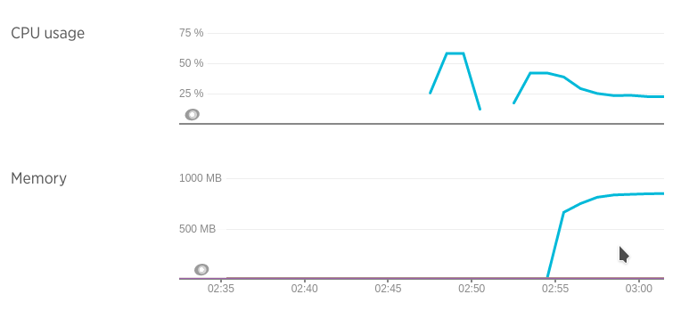
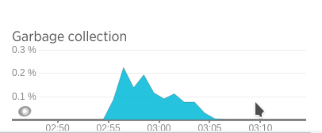
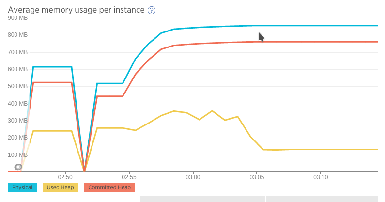
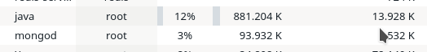

## Prueba de stress con un CPU y un nodo de MongoDB (standalone)

### Ejecución

* Docker:
  * Mongo DB:   `docker run -i --memory-swap 500M  --memory 500M  --cpuset-cpus="0" -p 27017:27017 --net=host -t arq2ag/mirar-para-cuidar-mongo ./mongo-run-standalone.sh`
  * Aplicación: `docker run -i --memory-swap 1200M --memory 1200M --cpuset-cpus="0" -p 8080:8080   --net=host -t arq2ag/mirar-para-cuidar-app   ./app-run.sh`
* Máquina host: `mvn gatling:execute -Ploadtest`

### Resultados

* Boot app  : 07/07 02:50
* Iniciado  : 07/07 02:54
* Finalizado: 07/07 03:05
* Stop app  : 07/07 03:10
* Simulación Gatling \#1467870860226

CPU - Memory usage

GC

Average memory usage

Memoria tomada por el proceso de Java

### Análisis

Consumo de memoria de la aplicación subió más allá de que la carga se mantuvo desde el minuto 3 del test.
Claramente hay una optimización por hacer en la aplicación. Incluso después de finalizado el test el consumo
no bajó.

