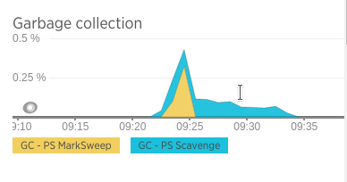
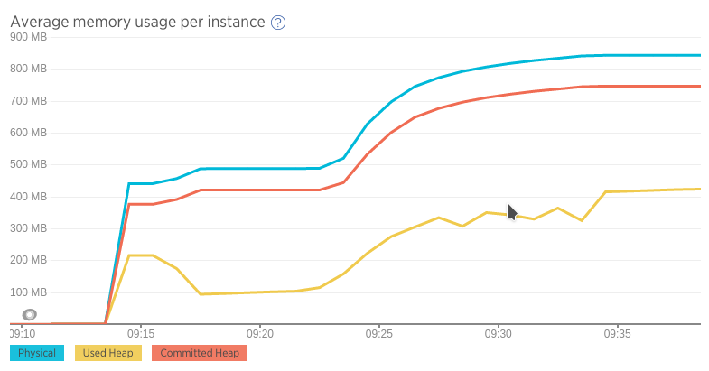
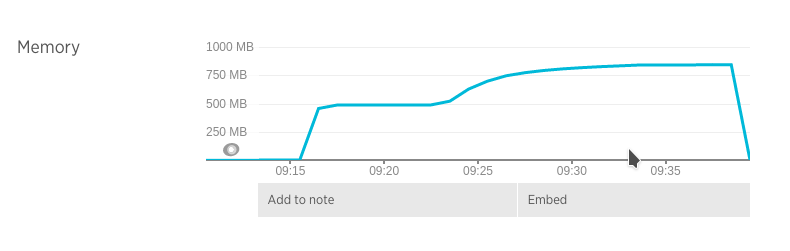
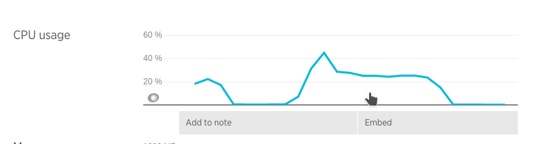
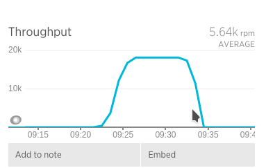
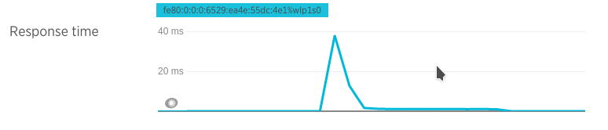
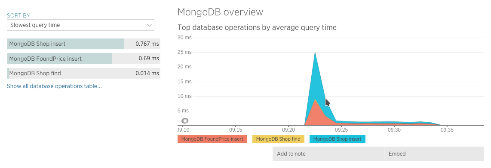

## Prueba de stress con dos CPUs y un nodo de MongoDB

### Ejecución

* Docker:
  * Mongo DB:   `docker run -i --memory-swap 500M  --memory 500M  --cpuset-cpus="0,1" -p 27017:27017 --net=host -t arq2ag/mirar-para-cuidar-mongo ./mongo-run-standalone.sh`
  * Aplicación: `docker run -i --memory-swap 1200M --memory 1200M --cpuset-cpus="0,1" -p 8080:8080   --net=host -t arq2ag/mirar-para-cuidar-app   ./app-run.sh`
* Máquina host: `mvn gatling:execute -Ploadtest`

### Resultados

* Boot app  : 07/07 09:14
* Iniciado  : 07/07 09:23
* Finalizado: 07/07 09:34
* Stop app  : 07/07 09:40
* Simulación Gatling \#1467894207189

#### Gráficos

GC

<iframe src="https://rpm.newrelic.com/public/charts/l4nDYEavmrx" width="500" height="300" scrolling="no" frameborder="no"></iframe>

Average memory usage

<iframe src="https://rpm.newrelic.com/public/charts/egSQKGOY6Hq" width="500" height="300" scrolling="no" frameborder="no"></iframe>

Memory usage

<iframe src="https://rpm.newrelic.com/public/charts/QzLjy2QBBb" width="500" height="300" scrolling="no" frameborder="no"></iframe>

CPU usage

<iframe src="https://rpm.newrelic.com/public/charts/aIabwBu9R32" width="500" height="300" scrolling="no" frameborder="no"></iframe>

Throughput

<iframe src="https://rpm.newrelic.com/public/charts/9q0IvIGjUQO" width="500" height="300" scrolling="no" frameborder="no"></iframe>

Response time

<iframe src="https://rpm.newrelic.com/public/charts/gtg2KSdAxEH" width="500" height="300" scrolling="no" frameborder="no"></iframe>

Mongo

<iframe src="https://rpm.newrelic.com/public/charts/gtg2KSdAxEH" width="500" height="300" scrolling="no" frameborder="no"></iframe>

### Análisis
