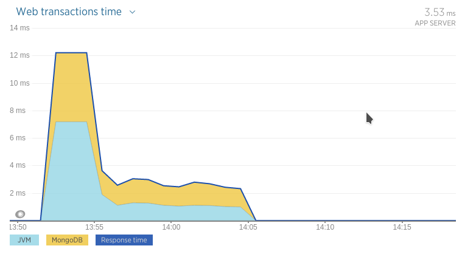

## Prueba de stress con un CPU y 2 nodos de MongoDB en réplica

### Ejecución

* Docker:
  * Mongo DB Slave:  `docker run -i --memory-swap 200M  --memory 200M  --cpuset-cpus="0" -p 27018:27018 --net=host -t arq2ag/mirar-para-cuidar-mongo ./mongo-run-slave-1.sh`
  * Mongo DB Master: `docker run -i --memory-swap 200M  --memory 200M  --cpuset-cpus="0" -p 27017:27017 --net=host -t arq2ag/mirar-para-cuidar-mongo ./mongo-run-master-1.sh`
  * Aplicación:      `docker run -i --memory-swap 1200M --memory 1200M --cpuset-cpus="0" -p 8080:8080   --net=host -t arq2ag/mirar-para-cuidar-app   ./app-run-rs1.sh`
* Máquina host: `mvn gatling:execute -Ploadtest`

### Resultados

* Boot app  : 08/07 13:52
* Iniciado  : 08/07 13:54
* Finalizado: 08/07 13:04
* Stop app  : 08/07 14:14
* Simulación Gatling \#1467996824384

#### Gráficos

Web transactions

<iframe src="https://rpm.newrelic.com/public/charts/1W4DzjwNHS3" width="500" height="300" scrolling="no" frameborder="no"></iframe>

GC

<iframe src="https://rpm.newrelic.com/public/charts/e6urh5a2jhH" width="500" height="300" scrolling="no" frameborder="no"></iframe>

Average memory usage

<iframe src="https://rpm.newrelic.com/public/charts/c9i7uHm5ijF" width="500" height="300" scrolling="no" frameborder="no"></iframe>

Memory usage

<iframe src="https://rpm.newrelic.com/public/charts/cn754EhlhJJ" width="500" height="300" scrolling="no" frameborder="no"></iframe>

CPU usage

<iframe src="https://rpm.newrelic.com/public/charts/8OQJsaZhZ5Y" width="500" height="300" scrolling="no" frameborder="no"></iframe>

Throughput

<iframe src="https://rpm.newrelic.com/public/charts/dXnDCE6xCyE" width="500" height="300" scrolling="no" frameborder="no"></iframe>

Response time

<iframe src="https://rpm.newrelic.com/public/charts/i4QRFxIrwLT" width="500" height="300" scrolling="no" frameborder="no"></iframe>

### Análisis
