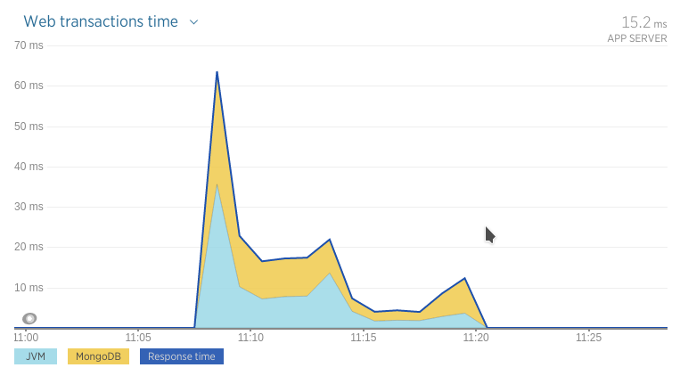
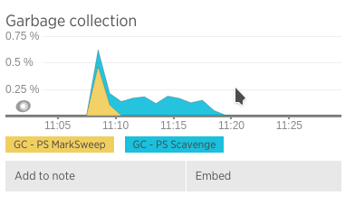
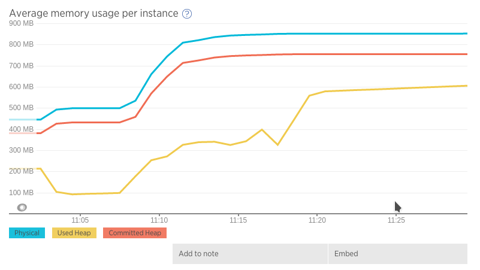
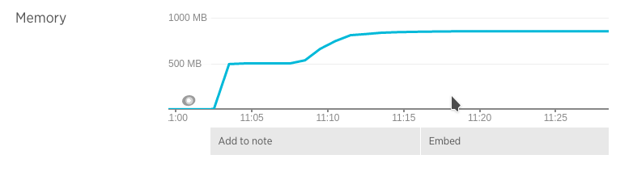
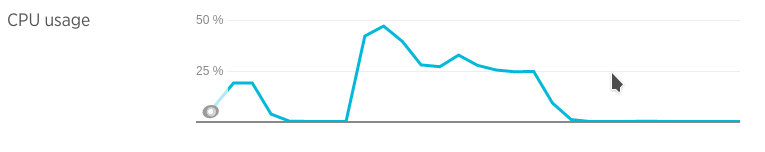
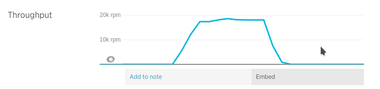
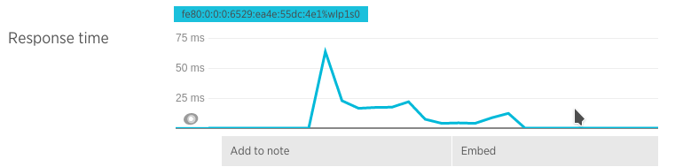

## Prueba de stress con un CPU y 3 nodos de MongoDB en réplica (eliminando un nodo Master durante el tope de carga)

### Ejecución

* Docker:
  * Mongo DB Slave 1: `docker run -i --memory-swap 200M  --memory 200M  --cpuset-cpus="0" -p 27018:27018 --net=host -t arq2ag/mirar-para-cuidar-mongo ./mongo-run-slave-2a.sh`
  * Mongo DB Slave 2: `docker run -i --memory-swap 200M  --memory 200M  --cpuset-cpus="0" -p 27019:27019 --net=host -t arq2ag/mirar-para-cuidar-mongo ./mongo-run-slave-2b.sh`
  * Mongo DB Master:
    * `docker run -i --memory-swap 200M  --memory 200M  --cpuset-cpus="0" -p 27017:27017 --net=host -t arq2ag/mirar-para-cuidar-mongo /bin/bash`
    * `./mongo-run-master-2.sh`
    * `Ctrl+C script anterior`
  * Aplicación:       `docker run -i --memory-swap 1200M --memory 1200M --cpuset-cpus="0" -p 8080:8080   --net=host -t arq2ag/mirar-para-cuidar-app   ./app-run-rs2.sh`
* Máquina host: `mvn gatling:execute -Ploadtest`

### Resultados

* Boot app  : 10/07 11:00
* Iniciado  : 10/07 11:08
* Eliminado nodo: 10/07 11:13 (44% de la prueba)
* Finalizado: 10/07 11:18
* Stop app  : 10/07 11:30
* Simulación Gatling \#1468159699391

Web transactions

<iframe src="https://rpm.newrelic.com/public/charts/45aqmfwytez" width="500" height="300" scrolling="no" frameborder="no"></iframe>

GC

<iframe src="https://rpm.newrelic.com/public/charts/cplneOkIS3R" width="500" height="300" scrolling="no" frameborder="no"></iframe>

Average memory usage

<iframe src="https://rpm.newrelic.com/public/charts/80sdlAou4gl" width="500" height="300" scrolling="no" frameborder="no"></iframe>

Memory usage

<iframe src="https://rpm.newrelic.com/public/charts/elnpube8fbB" width="500" height="300" scrolling="no" frameborder="no"></iframe>

CPU usage

<iframe src="https://rpm.newrelic.com/public/charts/fVzhr8QJ9s2" width="500" height="300" scrolling="no" frameborder="no"></iframe>

Throughput

<iframe src="https://rpm.newrelic.com/public/charts/1Mclp9qsvYA" width="500" height="300" scrolling="no" frameborder="no"></iframe>

Response time

<iframe src="https://rpm.newrelic.com/public/charts/2D3Or912K9J" width="500" height="300" scrolling="no" frameborder="no"></iframe>

### Análisis

* Tardó 13 segundos en hacer la transición de slave a master
