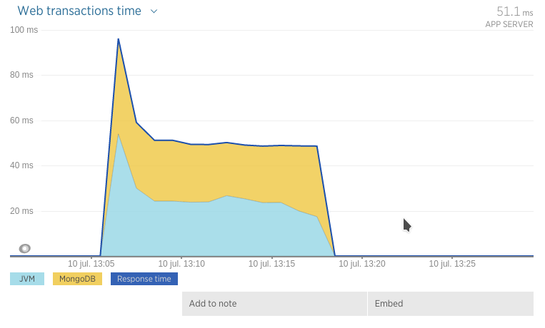
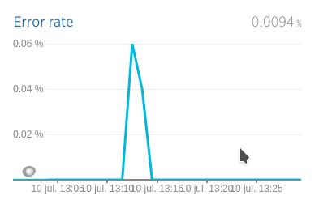
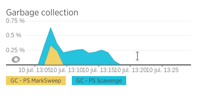
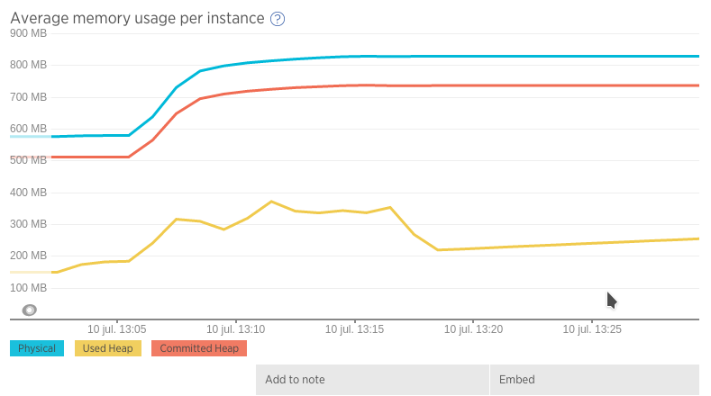
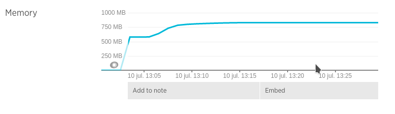
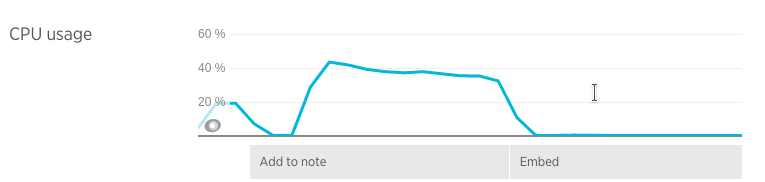
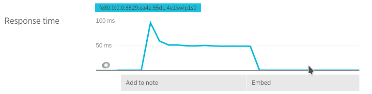

## Prueba de stress con un CPU y 3 nodos de MongoDB en réplica

(eliminando un nodo Master durante el tope de carga y luego reintegrándolo al Cluster inmediatamente)

### Ejecución

* Docker:
  * Mongo DB Slave 1: `docker run -i --memory-swap 200M  --memory 200M  --cpuset-cpus="0" -p 27018:27018 --net=host -t arq2ag/mirar-para-cuidar-mongo ./mongo-run-slave-2a.sh`
  * Mongo DB Slave 2: `docker run -i --memory-swap 200M  --memory 200M  --cpuset-cpus="0" -p 27019:27019 --net=host -t arq2ag/mirar-para-cuidar-mongo ./mongo-run-slave-2b.sh`
  * Mongo DB Master:
    * `docker run -i --memory-swap 200M  --memory 200M  --cpuset-cpus="0" -p 27017:27017 --net=host -t arq2ag/mirar-para-cuidar-mongo /bin/bash`
    * `> ./mongo-run-master-2.sh`
    * `> Ctrl+C script anterior`
    * `> mongod --port 27017 --replSet mpc2`
  * Aplicación:       `docker run -i --memory-swap 1200M --memory 1200M --cpuset-cpus="0" -p 8080:8080   --net=host -t arq2ag/mirar-para-cuidar-app   ./app-run-rs2.sh`
* Máquina host: `mvn gatling:execute -Ploadtest`

### Resultados

* Boot app  : 10/07 13:00
* Iniciado  : 10/07 13:06
* Eliminado nodo: 10/07 13:12
* Reincorporado nodo: 10/07 13:12 (20 segundos después de eliminado)
* Finalizado: 10/07 hh:19
* Stop app  : 10/07 13:30
* Simulación Gatling \#1468166792766

Web transactions

<iframe src="https://rpm.newrelic.com/public/charts/cIgcM75mz2x" width="500" height="300" scrolling="no" frameborder="no"></iframe>

Error rate

<iframe src="https://rpm.newrelic.com/public/charts/fT1LovSY60K" width="500" height="300" scrolling="no" frameborder="no"></iframe>

GC

<iframe src="https://rpm.newrelic.com/public/charts/3HzAUBBO8MO" width="500" height="300" scrolling="no" frameborder="no"></iframe>

Average memory usage

<iframe src="https://rpm.newrelic.com/public/charts/62gpaYANOV2" width="500" height="300" scrolling="no" frameborder="no"></iframe>

Memory usage

<iframe src="https://rpm.newrelic.com/public/charts/jYLDsD4FGgN" width="500" height="300" scrolling="no" frameborder="no"></iframe>

CPU usage

<iframe src="https://rpm.newrelic.com/public/charts/lP12fQAJyMf" width="500" height="300" scrolling="no" frameborder="no"></iframe>

Throughput

<iframe src="https://rpm.newrelic.com/public/charts/hG1dYHMrEGc" width="500" height="300" scrolling="no" frameborder="no"></iframe>

Response time

<iframe src="https://rpm.newrelic.com/public/charts/2gq7pzIfzIv" width="500" height="300" scrolling="no" frameborder="no"></iframe>
