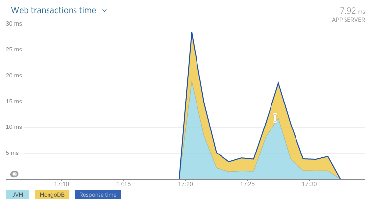
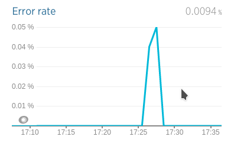
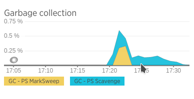
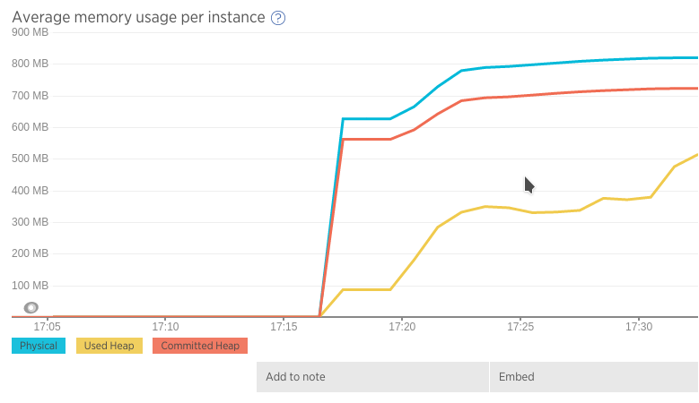
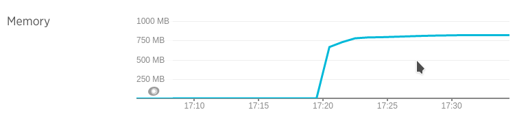
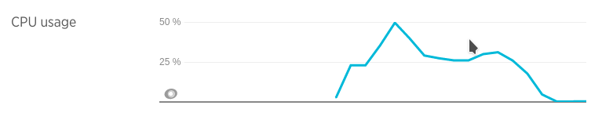
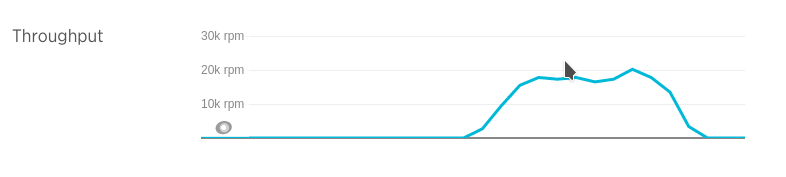
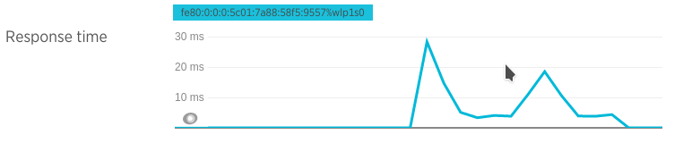

## Prueba de stress con un CPU y 3 nodos de MongoDB en réplica

Mismo que el caso 3c) pero con una diferente configuración de la réplica de MongoDB.

Se agregaron los siguientes parámetros:

* `heartbeatTimeoutSecs`: seteado a 1 segundo
* `electionTimeoutMillis`: seteado a 1 segundo

con el fin de disparar la elección más rápido y así minimizar el impacto del cambio en la réplica.

Esta configuración tiene implicancias, por ejemplo si el nodo tiene una latencia de 1 segundo,
ya se lo va a considerar como caído y se va a disparar un doble proceso de configuración de réplica,
que no es muy costoso pero si ocurre varias veces puede empezar a ser un problema en la performance general.

### Ejecución

* Docker:
  * Mongo DB Slave 1: `docker run -i --memory-swap 200M  --memory 200M  --cpuset-cpus="0" -p 27018:27018 --net=host -t arq2ag/mirar-para-cuidar-mongo ./mongo-run-slave-2a.sh`
  * Mongo DB Slave 2: `docker run -i --memory-swap 200M  --memory 200M  --cpuset-cpus="0" -p 27019:27019 --net=host -t arq2ag/mirar-para-cuidar-mongo ./mongo-run-slave-2b.sh`
  * Mongo DB Master:
    * `docker run -i --memory-swap 200M  --memory 200M  --cpuset-cpus="0" -p 27017:27017 --net=host -t arq2ag/mirar-para-cuidar-mongo /bin/bash`
    * `> mongod --port 27017 --replSet mpc2 --logpath /var/log/mongodb/mongo.log &`
    * `> mongo --eval 'rs.initiate({_id:"mpc2", members: [{"_id":1, "host":"localhost:27017"}, {"_id":2, "host":"localhost:27018"}], settings: { heartbeatTimeoutSecs: 1, electionTimeoutMillis: 1000 } })'`
    * `> tail -f /var/log/mongodb/mongo.log`
    * `> Ctrl+C script anterior`
    * `> mongod --port 27017 --replSet mpc2`
  * Aplicación:       `docker run -i --memory-swap 1200M --memory 1200M --cpuset-cpus="0" -p 8080:8080   --net=host -t arq2ag/mirar-para-cuidar-app   ./app-run-rs2.sh`
* Máquina host: `mvn gatling:execute -Ploadtest`

### Resultados

* Boot app  : 11/07 17:17
* Iniciado  : 11/07 17:20
* Eliminado nodo: 11/07 17:23 (24% de la prueba)
* Reincorporado nodo: 11/07 17:26 (55% de la prueba)
* Finalizado: 11/07 17:30
* Stop app  : 11/07 17:35
* Simulación Gatling \#1468268444338

Web transactions

<iframe src="https://rpm.newrelic.com/public/charts/91Ab8yHxmqW" width="500" height="300" scrolling="no" frameborder="no"></iframe>

Error rate

<iframe src="https://rpm.newrelic.com/public/charts/kftV5Y95mA3" width="500" height="300" scrolling="no" frameborder="no"></iframe>

GC

<iframe src="https://rpm.newrelic.com/public/charts/ehy2UMCj5bF" width="500" height="300" scrolling="no" frameborder="no"></iframe>

Average memory usage

<iframe src="https://rpm.newrelic.com/public/charts/cuRjbkfZkG0" width="500" height="300" scrolling="no" frameborder="no"></iframe>

Memory usage

<iframe src="https://rpm.newrelic.com/public/charts/2MQ1sSi8yYD" width="500" height="300" scrolling="no" frameborder="no"></iframe>

CPU usage

<iframe src="https://rpm.newrelic.com/public/charts/i3lHzVUhbBp" width="500" height="300" scrolling="no" frameborder="no"></iframe>

Throughput

<iframe src="https://rpm.newrelic.com/public/charts/5jIcVTo4ZOR" width="500" height="300" scrolling="no" frameborder="no"></iframe>

Response time

<iframe src="https://rpm.newrelic.com/public/charts/5AaPXU2aiW2" width="500" height="300" scrolling="no" frameborder="no"></iframe>

### Análisis

Este cambio en la configuración produjo la misma cantidad de errores que en los casos anteriores, que es muy poca
pero si se apunta al High Availability, es bueno ver que una medida que a priori prometía ser buena, en realidad
no hacía variar el resultado.
